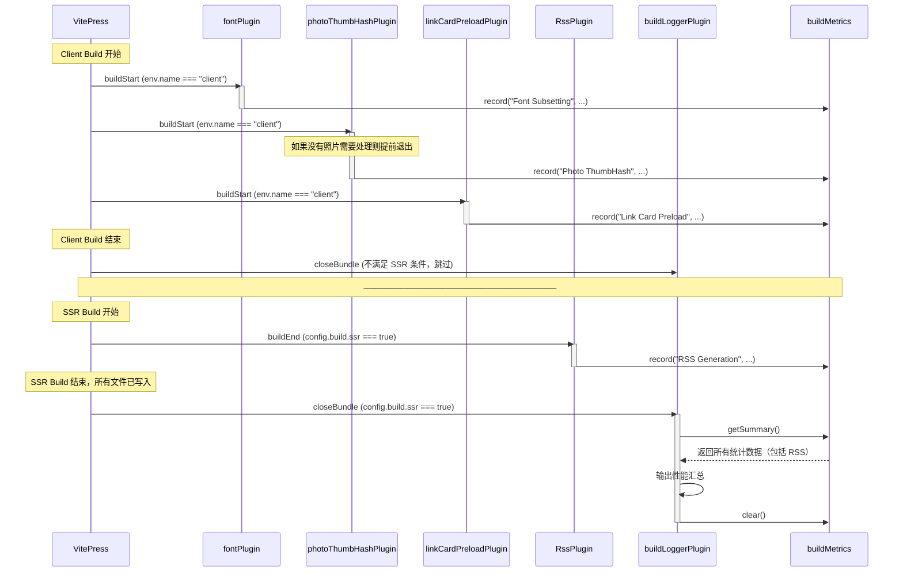

# 构建日志系统实现

## 📊 项目概述

为博客项目实现了一个构建时的性能监控和日志输出系统，用于追踪各个构建插件的耗时和性能占比。

## 🎯 实现目标

1. ✅ 通过环境变量控制输出详细程度
2. ✅ 不破坏 VitePress 原有的 ora spinner 输出
3. ✅ 提供每个构建阶段的耗时和百分比统计
4. ✅ 零额外依赖（除 consola 外）
5. ✅ 统计所有插件包括 RSS Generation

## 🏗️ 技术方案

### 选择的方案：Consola + 简洁文本输出

**为什么选择 Consola：**

- 属于 UnJS 生态（与 Vite 同一生态系统）
- 原生支持日志级别控制（silent/error/warn/log/info/debug/trace）
- 符合项目偏好：使用成熟依赖而非手写工具

**为什么不使用表格库（cli-table3）：**

- 日志输出是辅助功能，不应引入额外依赖链
- 代码可维护性更好：简单的字符串拼接，一目了然
- 与 Vite/VitePress 生态一致：都使用简洁文本输出
- 性能更好：纯字符串拼接，零解析开销

## 📁 文件结构

```
packages/theme/src/node/
├── utils/
│   └── logger.ts                    # Logger 工具和 BuildMetrics 收集器
├── plugins/
│   ├── build-logger.ts              # 构建日志输出插件（新增）
│   ├── font.ts                      # 字体子集化插件（添加监控）
│   ├── photo-thumbhash.ts           # 图片 ThumbHash 生成插件（添加监控）
│   ├── link-card-preload.ts         # 链接卡片预加载插件（添加监控）
│   └── rss.ts                       # RSS 生成插件（添加监控）
└── config.ts                        # 注册 buildLoggerPlugin
```

## 🔧 核心实现

### 1. Logger 工具 (`utils/logger.ts`)

```typescript
import { createConsola, LogLevels } from "consola";

// 解析环境变量 VITE_LOG_LEVEL
export const logger = createConsola({
  level: parseLogLevel(), // silent/error/warn/info/debug/trace
});

// 性能指标收集器（全局单例）
export class BuildMetrics {
  private metrics = new Map<string, { duration; count?; details? }>();

  record(
    phase: string,
    duration: number,
    count?: number,
    details?: string,
  ): void;
  getSummary(): Array<{ phase; duration; count?; details?; percentage }>;
  clear(): void;
}

export const buildMetrics = new BuildMetrics();
```

### 2. 构建日志插件 (`plugins/build-logger.ts`)

```typescript
function createBuildLoggerPlugin(): PluginOption {
  let config: any;

  return {
    name: "vite-plugin-build-logger",

    configResolved(resolvedConfig: any) {
      config = resolvedConfig;
    },

    async closeBundle() {
      // 只在 SSR build 结束时输出（最后一次 build）
      if (!config?.vitepress || !config.build?.ssr) return;

      // 只在 info 及以上级别输出汇总
      if (logger.level < LogLevels.info) return;

      const summary = buildMetrics.getSummary();
      if (summary.length === 0) return;

      // 输出性能汇总（简洁文本格式）
      console.log("");
      logger.info("📊 Build Performance");
      console.log("─".repeat(70));

      summary.forEach(({ phase, duration, percentage, count, details }) => {
        console.log(
          `${phase.padEnd(25)} ${time} ${percent} ${bar} (${count} items)`,
        );

        // debug 模式显示详情
        if (details && logger.level >= LogLevels.debug) {
          console.log(`  ↳ ${details}`);
        }
      });

      console.log("─".repeat(70));
      console.log(`Total: ${formatDuration(totalDuration)}`);

      buildMetrics.clear();
    },
  };
}

export const buildLoggerPlugin = createBuildLoggerPlugin();
```

**关键点：**

- 使用 `closeBundle` 钩子而非 `buildEnd`，确保在所有插件完成后输出
- 使用函数闭包保存 `config` 变量，避免对象字面量中 `this` 的问题
- 检测 SSR build (`config.build.ssr`)，只在最后一次构建时输出

### 3. 插件监控模式

所有插件按照统一模式添加监控：

```typescript
async buildStart() {
  const startTime = performance.now();

  // ... 执行插件逻辑 ...

  const duration = performance.now() - startTime;
  buildMetrics.record("Plugin Name", duration, count, details);
}
```

## 🎨 输出效果

### Info 模式（默认）

```
ℹ 📊 Build Performance
──────────────────────────────────────────────────────────────────────
RSS Generation               908ms  94.7% ██████████████████████████████████████
Font Subsetting               26ms   2.7% █ (1 items)
Link Card Preload             25ms   2.6% █ (67 items)
──────────────────────────────────────────────────────────────────────
Total: 959ms
```

### Debug 模式

```
ℹ 📊 Build Performance
──────────────────────────────────────────────────────────────────────
RSS Generation               908ms  94.7% ██████████████████████████████████████
Font Subsetting               26ms   2.7% █ (1 items)
  ↳ 1 font(s), 1623 unique characters
Link Card Preload             25ms   2.6% █ (67 items)
  ↳ 67 pages scanned
──────────────────────────────────────────────────────────────────────
Total: 959ms
```

## 🎮 使用方法

### 环境变量控制

```bash
# 默认模式 - 仅显示汇总
pnpm run build

# 调试模式 - 显示详细信息
VITE_LOG_LEVEL=debug pnpm run build

# 静默模式 - 无额外输出
VITE_LOG_LEVEL=silent pnpm run build

# 其他级别
VITE_LOG_LEVEL=error   # 仅错误
VITE_LOG_LEVEL=warn    # 警告和错误
VITE_LOG_LEVEL=trace   # 最详细输出
```

## ⚙️ 插件执行时机

### VitePress 构建流程

VitePress 执行两次构建：

1. **Client Build** - 构建客户端代码（env.name === "client"）
2. **SSR Build** - 构建服务端渲染代码（config.build.ssr === true）

### 插件执行时序图



### 插件详细说明

| 插件                      | 钩子        | 执行条件                  | 功能               |
| ------------------------- | ----------- | ------------------------- | ------------------ |
| **fontPlugin**            | buildStart  | env.name === "client"     | 字体子集化处理     |
| **photoThumbHashPlugin**  | buildStart  | env.name === "client"     | 生成图片 ThumbHash |
| **linkCardPreloadPlugin** | buildStart  | env.name === "client"     | 预加载链接卡片数据 |
| **RssPlugin**             | buildEnd    | config.build.ssr === true | 生成 RSS feed      |
| **buildLoggerPlugin**     | closeBundle | config.build.ssr === true | 输出性能汇总       |

### 🔍 技术细节

**为什么使用 closeBundle 而非 buildEnd？**

在 VitePress 的 SSR build 中，插件执行顺序：

1. 所有插件的 `buildEnd` 钩子（按 enforce 顺序）
2. 所有插件的 `closeBundle` 钩子（最后执行）

**问题：** 如果在 `buildEnd` 中输出：

- RSS Plugin (enforce: "pre") 的 buildEnd 在 buildLoggerPlugin 之后才执行
- buildLoggerPlugin 输出时，RSS 的数据还未记录

**解决方案：** 使用 `closeBundle` 钩子：

- `closeBundle` 在所有文件写入完成后执行
- 此时所有插件（包括 RSS）都已完成并记录了指标
- 确保能收集到完整的性能数据

**Vite Plugin Hook 执行顺序：**

```
buildStart → ... → buildEnd (pre → normal → post) → closeBundle
```

## 📝 设计原则

### 为什么不在 debug 模式输出实时日志？

**问题：** VitePress 使用 ora spinner，在 spinner 运行时任何输出都会混在一起

**尝试过的方案：**

1. ❌ `logger.start()` - 创建新 spinner，与 VitePress spinner 冲突
2. ❌ `logger.debug()` - 输出和 spinner 混在同一行

**最终方案：** 完全不输出实时日志，在汇总中根据日志级别显示详情

- Info 模式：不显示详情
- Debug 模式：显示详情（`↳` 行）

### 代码可维护性考量

**选择简洁文本输出而非表格库的原因：**

1. **单一职责** - 已经有 Consola 做日志，不需要另一个表格库
2. **代码清晰** - 未来维护者看代码就知道输出什么
3. **调试方便** - 直接修改字符串立即看到效果
4. **生态一致** - Vite/VitePress/Consola 都用简洁文本
5. **性能更好** - 纯字符串拼接，零依赖解析

## 🎯 最佳实践

### 添加新插件监控

```typescript
// 在插件的 buildStart 或 buildEnd 中
async buildStart() {
  const startTime = performance.now();

  // 执行插件逻辑
  const result = await doSomething();

  // 记录性能指标
  const duration = performance.now() - startTime;
  buildMetrics.record(
    "Display Name",        // 显示名称
    duration,              // 耗时（ms）
    result.count,          // 可选：处理项数量
    "additional details"   // 可选：详细信息（debug 模式显示）
  );
}
```

### 环境变量配置建议

**开发时：**

```bash
# .env.local
VITE_LOG_LEVEL=debug
```

**CI/CD：**

```bash
# 生产构建保持简洁
VITE_LOG_LEVEL=info  # 或不设置（默认）
```

## 🐛 问题排查记录

### 问题 1：RSS Generation 不显示在汇总中

**现象：** 最初实现中，RSS Generation 永远不会出现在性能汇总中

**原因：**

1. VitePress 有两次构建：Client Build 和 SSR Build
2. buildLoggerPlugin 最初在 `buildEnd` 中输出，检测 `env.name === "client"`
3. RSS Plugin 在 SSR Build 的 `buildEnd` 中执行
4. Client Build 结束时输出并 clear，此时 RSS 还未执行

**尝试的解决方案：**

1. ❌ 改为检测 `config.build.ssr`，但 buildEnd 中 RSS 和 Logger 的执行顺序问题
2. ❌ 使用 `enforce: "post"` 试图最后执行，但在 buildEnd 中 post 反而先于 pre 执行

**最终解决方案：**

- 使用 `closeBundle` 钩子代替 `buildEnd`
- `closeBundle` 在所有文件写入后执行，是最后的钩子
- 此时所有插件（包括 RSS）都已完成

### 问题 2：对象字面量中无法正确访问 config

**现象：** 使用对象字面量定义插件时，`this.config` 无法访问

**解决方案：** 使用工厂函数创建插件，用闭包保存 config 变量

```typescript
// ❌ 不工作
export const buildLoggerPlugin = {
  config: undefined,
  configResolved(c) {
    this.config = c;
  },
  buildEnd() {
    console.log(this.config);
  }, // undefined
};

// ✅ 工作
function createBuildLoggerPlugin() {
  let config: any;
  return {
    configResolved(c) {
      config = c;
    },
    buildEnd() {
      console.log(config);
    }, // 正确
  };
}
```

## 📚 相关依赖

- **consola**: ^3.4.2 - 日志工具
- **vite**: ^6.3.5 - 构建工具
- **vitepress**: ^2.0.0-alpha.12 - 静态站点生成器

## 🔗 参考文档

- [Consola 文档](https://github.com/unjs/consola)
- [Vite Plugin API](https://vite.dev/guide/api-plugin)
- [Rollup Plugin Hooks](https://rollupjs.org/plugin-development/#build-hooks)
- [VitePress 构建流程](https://vitepress.dev/guide/what-is-vitepress)
