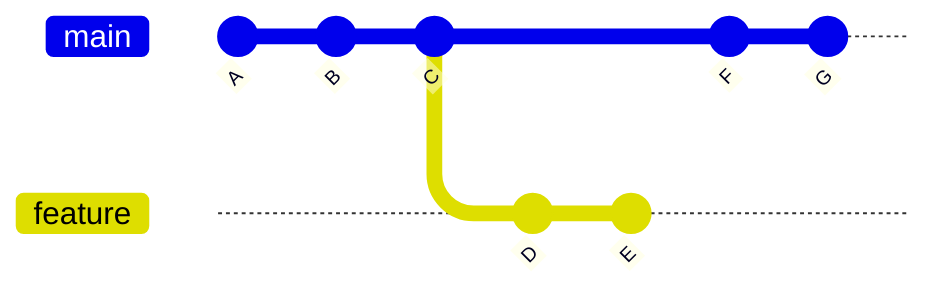
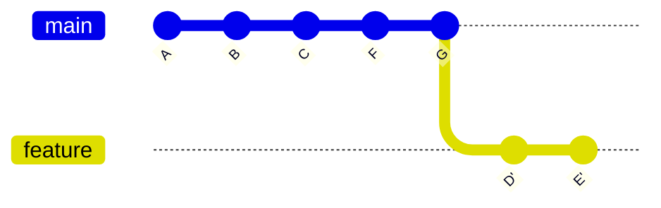
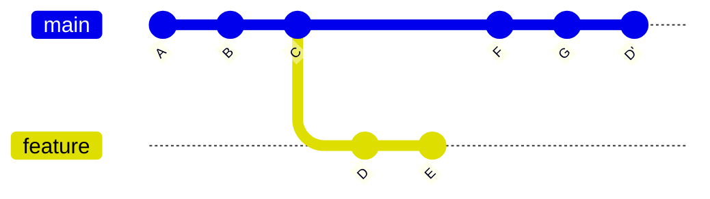

写这一篇文章主要是因为，在使用 Git 的时候遇到了一些不太懂的情况。询问 GPT 之后才发现如此有趣，这里记录一下。

## rebase

这里首先讲一下 git rebase，它的常见用法是 `git rebase branchA branchB`，它的意思是指先找到 branchA 和 branchB 之间共同的祖先，然后沿着祖先到 branchA 的最远端，依次提交到 branchB 中。这种方式相比 merge 能够保证我们 Git 提交历史的整洁。但是我并不知道 rebase 这个过程中究竟发生了什么，现在一起探究一下

首先构造这样一个场景

rebase 之后就变成了

首先我们注意到，将 feature 中的每个提交 rebase 到 main 的时候，原来 branchA 中每个提交的 commit hash 发生了变化。出现这种情况的原因是，rebase 实际上做的是重放，而不是复制粘贴。因此我认为 rebase 的本质就是：**对一段连续的提交，按顺序依次执行 cherry-pick**

## cherry-pick

读者可能又不明白什么是 cherry pick，这里补充一点信息

`git cherry-pick` 实际上就是把“某一次提交所做的修改”单独拿出来，应用到当前分支上，并生成一个新的提交。需要注意的是，这里并不是简单的对提交进行复制粘贴。它的内部流程大致是这样：

1. 计算我们要 pick 的提交和它的父提交之间的一个差异（diff）
2. 将该差异应用到我们当前所处的分支
3. 提交应用的这部分内容（因此是新的提交）

你可以动手模拟一下这个过程，以上面的场景为例：假设我们在 main 分支上执行 `git cherry-pick D`，就会得到下面的历史

这个过程的操作在概念上可以理解为三步的合并：

1. `git diff D^..D` > D.patch
2. `git checkout main && git apply D.patch`
3. `git commit -m "cherry-pick D"`

> [!IMPORTANT]
> 需要注意的是，这里的 diff → apply → commit 只是对 cherry-pick 行为的概念拆解。在 Git 的真实实现中，并不会真的生成补丁文件，而是直接在内部计算差异并重放提交。
