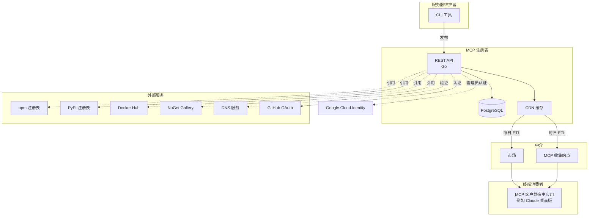
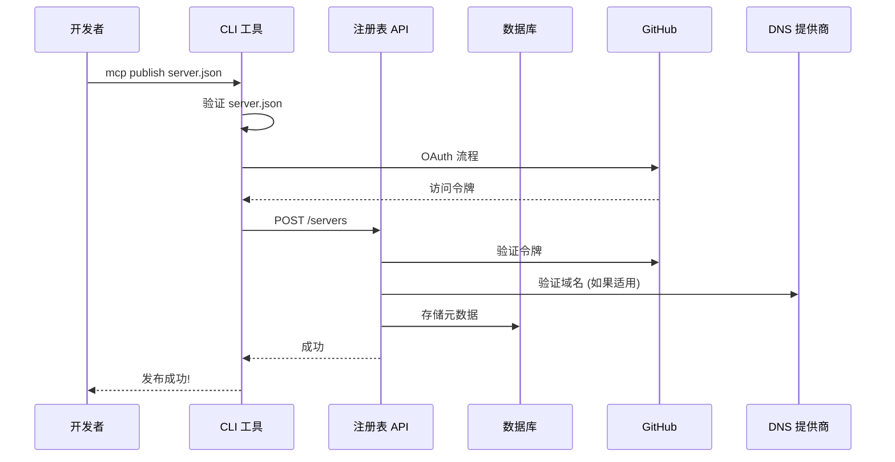
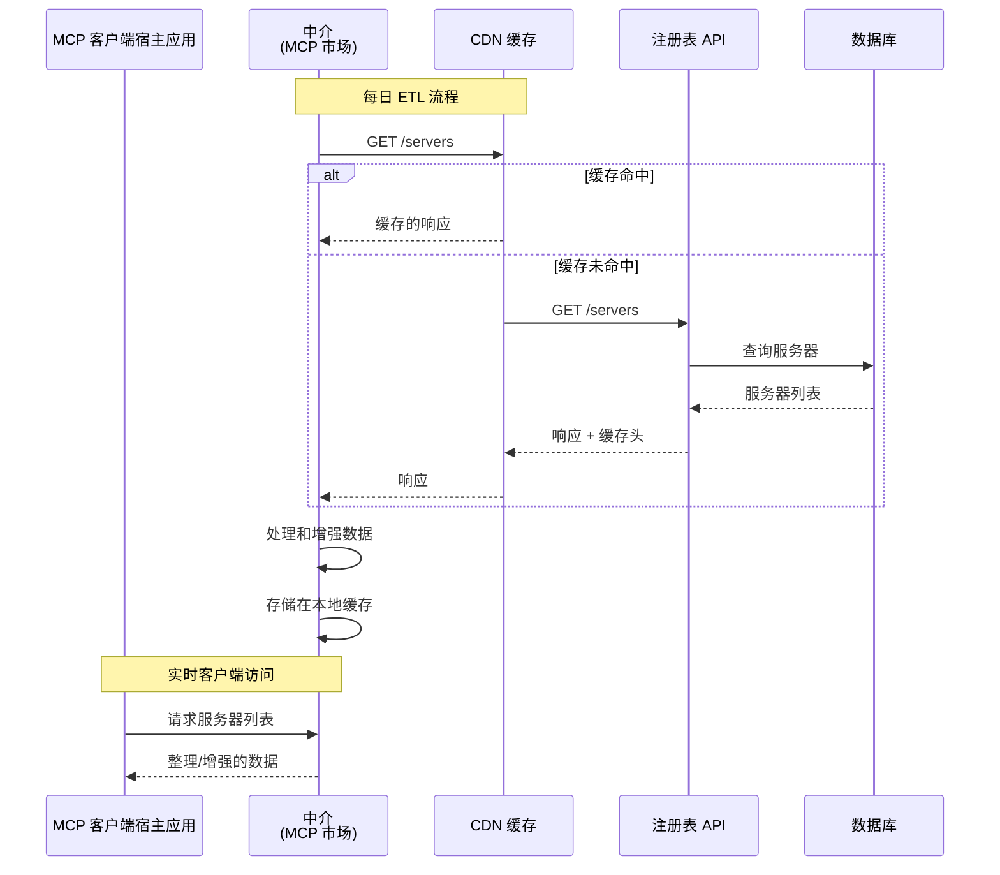
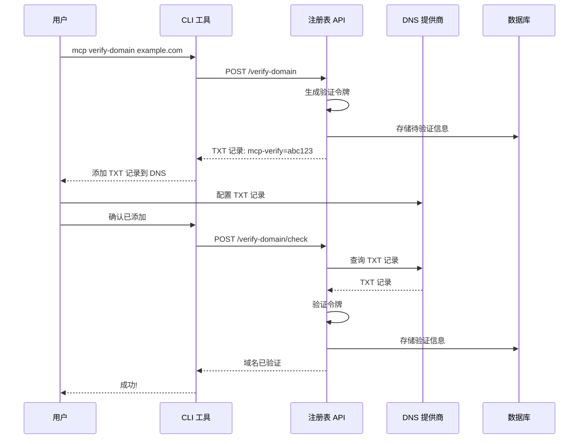

## 简介

MCP registry 是一个类似 MCP 商店的服务，能够为不同的 MCP client 提供可用的 MCP server 列表。之所以提供这个服务，原因如下：

1. 当前分发 MCP 非常困难且碎片化，用户需要自己去各个平台（如 GitHub，mcp.so 等）寻找需要的 server
2. 寻找到的 server 良莠不齐，并且安全性不能保证

Anthropic 官方希望通过这个 registry，将 MCP 的生态打造成如下图这样：


首先看左上角，MCP 开发者开发完 server 后，需要完成两步操作

1.  将服务器的代码提交到依赖的生态中，比如使用 TypeScript SDK 写的 MCP server 会提交到 npm 中，使用 python SDK 写的会提交到 pypi 中
2.  在 MCP 官方注册表中注册自己的 MCP server，注意这里注册并不意味着 server 代码托管到这里，这里托管的是 server 的元信息，比如实际 server 托管的位置（如上面提到的 npm），这样官方注册表就知道如何去寻找你的 MCP server

再看中间部分，也分为两块区域，他们共同构成官方镜像的镜像源层

1.  其中中间偏上的三个方框表示的是中介的镜像，他们会每日拉取官方镜像的内容，并进行 ETL（extract、transform、load）的操作，像这样的中介镜像还有很多，这张图里只展示了可能的几个，我们当然也可以自己构建自己的镜像
2.  中间偏下的也是中介镜像，相比前面背靠大公司的镜像源，这些镜像可能更加私人化，能够提供更丰富的功能（也许）

最下面是用户接触最多的 MCP client 部分，当用户使用某个 client（比如 VSCode），打开里面内置的 MCP market 时，client 会向中间部分的镜像源发起请求，获取 MCP servers 的元信息。

> [!NOTE]
> 注意客户端不是直接向官方镜像源发起的请求，而是向中介镜像源发起请求！官方镜像源提供的信息相比中介镜像源可能会少很多，比如没有 server 的 tag 等，因为没有 ETL 这一步操作，具体缺少的信息可以 [MCP registry 路线图](https://github.com/modelcontextprotocol/registry/blob/main/docs/roadmap.md)，我这里简单总结一下：
>
> 1. 源代码托管：注册表永远不会托管实际的 MCP server 代码
> 2. 质量排名：不会对托管的 MCP server 进行好坏的评估和排名
> 3. 搜索引擎：注册表不会提供提供高级搜索功能（比如向量检索等），因为就不是给个人用户使用的
> 4. 服务器标签或分类：为了减轻审核负担，不添加该功能

## 初次上手

使用这个项目需要准备两个工具：

1. docker
2. go

首先执行 `git clone git@github.com:modelcontextprotocol/registry.git` 将仓库克隆下来，然后进入到项目中执行 `make dev-compose`，这条命令会启动一个 docker 服务，该服务使用 PostgreSQL 和一些随机数据在 `localhost:8080` 启动注册表服务。我们打开 `http://localhost:8080/docs`，就能看到一个页面


我们可以试着请求其中一个接口：

```bash
curl --request GET \
  --url http://localhost:8080/v0/servers \
  --header 'Accept: application/json, application/problem+json'
```

结果格式化后为（节选）：

```json
{
  "servers": [
    {
      "name": "io.github.kenjihikmatullah/productboard-mcp",
      "description": "Integrate the Productboard API into agentic workflows via MCP",
      "status": "active",
      "repository": {
        "url": "https://github.com/kenjihikmatullah/productboard-mcp",
        "source": "github",
        "id": "939104710"
      },
      "version_detail": {
        "version": "0.0.1-seed"
      },
      "packages": [
        {
          "registry_type": "npm",
          "registry_base_url": "https://registry.npmjs.org",
          "identifier": "productboard-mcp",
          "version": "1.0.1",
          "transport_type": "stdio",
          "environment_variables": [
            {
              "description": "<YOUR_TOKEN>",
              "name": "PRODUCTBOARD_ACCESS_TOKEN"
            }
          ]
        }
      ],
      "_meta": {
        "io.modelcontextprotocol.registry": {
          "id": "00613acb-73e2-4f93-8b96-296df17316c8",
          "published_at": "0001-01-01T00:00:00Z",
          "updated_at": "0001-01-01T00:00:00Z",
          "is_latest": true,
          "release_date": "2025-05-16T19:12:44Z"
        }
      }
    }
  ]
}
```

## 设计架构



这个服务的核心组件包括：

1. 一个使用 go 实现的服务器，用来：
   1. 获取 MCP server 的列表
   2. 发布 MCP server 的渠道
   3. GitHub OAuth 等鉴权系统的集成
   4. DNS 验证系统，用来指定命名空间
2. PostgreSQL 数据库，用来
   1. 存储 MCP server 的元数据
   2. 存储用户认证信息
   3. DNS 验证记录
3. 一个 CLI 工具，用来：
   1. 发布 MCP server
   2. 进行 GitHub OAuth 认证
   3. DNS 认证
4. CDN 层，主要为了可拓展性

### 服务器发布流程图



### MCP server 消费者流程图



### DNS 验证流程图


