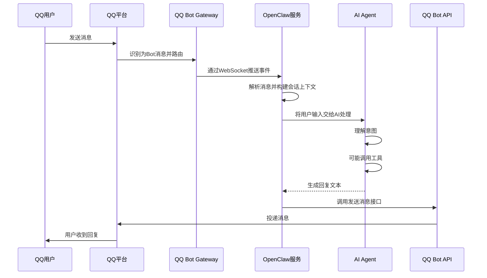

OpenClaw 是一个自托管的 AI 助手网关，我们能够使用这个应用在自己的机器或服务器上运行一个 Gateway 进程，把常用聊天应用（如 QQ、WhatsApp、Telegram、Discord、iMessage 等）连接到 AI 代理，从而在熟悉的聊天工具中与 agent 对话

这里介绍一下 QQ 的连接方式，通过 Step-by-Step 的这种保姆式方式，带你实地接入一下

## QQ Bot 创建

### 注册 QQ 开放平台账号

我们首先前往腾讯 QQ [官方开放平台](https://q.qq.com/#/register)，注册一个新的账号


完成注册流程后，跟随平台的指引创建一个超级管理员


在使用 QQ 成功扫描二维码之后，下一步是填写相关的主体信息。

这里我们以“个人主体”作为例子：

1. 跟随指引填入名称、身份证号、手机号以及验证码
2. 点击“继续”按钮来进行人脸验证


然后使用手机 QQ 扫描二维码，来进行人脸验证。


人脸验证识别完成后，我们就可以登录 QQ 开放平台了。


### 创建 QQ 机器人

跟随下面图片的指示，创建 QQ 机器人。


当 QQ 机器人创建后，你可以选中并点击它，进入管理页面。


在 QQ 机器人管理页面，获取当前机器人的 AppID 和 AppSecret 两个信息。复制并妥善保存它们

注意：出于安全原因，QQBot 的 AppSecret 不会以明文形式存储。一旦查看后如果你遗忘了它，就需要重新生成一遍。


### 沙箱配置

在左侧的“沙箱配置” Tab 页，我们为我们自己添加这个机器人


> [!NOTE]
> 此处创建的QQ机器人仅限个人（沙盒环境）调试体验。发布后可以获取更多功能

执行完这一步以后，你可以扫描“添加成员”左侧的二维码，打开机器人的对话页面。但是此时还无法进行对话，因为我们还没有配置 OpenClaw


## OpenClaw 配置

首先通过下面的命令安装 OpenClaw，并执行 onboard 流程（注意需要有 Node 22 及以上的环境支持）：

```bash
npm i -g openclaw
openclaw onboard
openclaw plugins install @sliverp/qqbot@latest # 安装 QQBot 插件
```

执行命令后可以看到下面的界面：


然后选择你希望使用的供应商：


配置完模型提供商之后，我们接着配置希望使用的通信 IM，移动到 QQBot 部分，我们选中它，然后进行配置


跟随指引填入我们上面出现的 AppID 还有 AppSecret 就可以。配置完之后就可以正常对话了


## 常见问题

### 接口访问源不在 IP 白名单

你可以在日志（位于 `~/.openclaw/logs/gateway.err.log`）中看到这样的日志条目

```
2026-02-24T14:25:19.477Z [qqbot] [qqbot:default] Connection failed: Error: API Error [/gateway]: 接口访问源IP不在白名单
```


想要理解这个配置的作用，我们先看一下 OpenClaw 的原理。

我们在与 QQ 机器人对话的时候，首先发送给 QQ 平台，然后 QQ 平台再转发给 Gateway。随后 Gateway 生成消息之后，会给 QQ Bot API 发送信息，这一步是会检验白名单的。



同时注意，我们可能是在局域网中部署服务的。但是在发送请求时，对方看到的肯定不是我们的局域网 IP。因此，我们需要找到自己的出站 IP 地址，可以通过执行下面这个命令看到：

```bash
curl ifconfig.me # 样例输出 212.107.30.201
```

配置之后就可以进行正常对话了。

