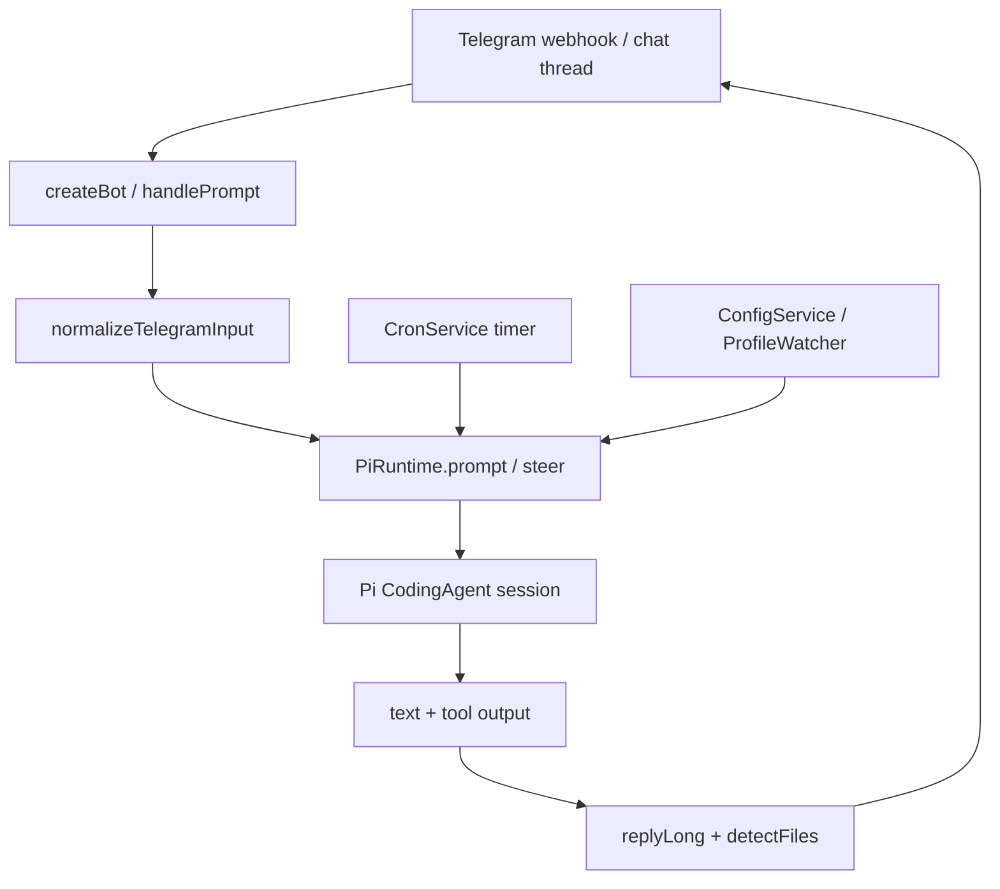

shellRaining 的核心定位是一个 Telegram-first 的个人工程代理。Telegram 是入口，Pi CodingAgent 是执行内核，shellRaining 本身主要做消息路由、状态持久化、会话桥接、配置热重载和结果回传。

如果只看主链路，它并不是一个自己重新实现的 agent 框架，而是一层把 Telegram 线程映射到 Pi session 的运行时适配器。



## 启动入口

`apps/agent/src/index.ts` 是服务入口，启动时大致做这些事情：

1. 读取 `.env` 和 shellRaining 配置。
2. 初始化日志服务和 `ConfigService`。
3. 创建 `CronStore` / `CronService`。
4. 创建 `PiRuntime`，并把 cron tool extension 注入进去。
5. 创建 Telegram bot runtime。
6. 启动 Hono HTTP 服务，暴露 `/health` 和 `/webhook/telegram`。

这里最重要的关系是：HTTP 服务不直接理解 agent 逻辑，它只把 Telegram webhook 交给 `botRuntime.chat.webhooks.telegram()`。真正的消息处理发生在 `createBot()` 里面。

## Telegram 层

`apps/agent/src/bot.ts` 把 Telegram 输入分成两类：命令和普通 prompt。

命令包括 `/start`、`/pwd`、`/cd`、`/session`、`/new`、`/status` 等，它们只操作本地状态或 session，不进入 Pi 推理。普通消息会进入 `handlePrompt()`，它的流程是：

1. 根据 Telegram thread id 生成稳定的 `threadKey`。
2. 检查用户是否在 `allowedUsers` 中。
3. 调用 `normalizeTelegramInput()` 处理文本、图片、文件、语音和 sticker。
4. 给 prompt 注入当前时间前缀。
5. 如果同一 thread 已经有 Pi 在运行，则走 `runtime.steer()`。
6. 否则读取当前 workspace，记录执行前文件快照，调用 `runtime.prompt()`。
7. 回复文本，并检测新生成的文件回传给 Telegram。

这个设计让三个 Telegram 入口复用同一套逻辑：私聊、mention、已订阅线程最终都会落到命令处理或 prompt 处理。

## 输入归一化

`apps/agent/src/runtime/telegram-input.ts` 负责把 Telegram message 转成 Pi 可消费的结构：

- 普通文本直接进入 prompt。
- 图片会保存到本地 inbox，同时转成 base64 image input 传给 Pi。
- 非图片文件只保存到本地，并把绝对路径写进 prompt，由 Pi 后续按需读取。
- 音频可以走可插拔 STT；如果没有配置 STT，就只保留音频文件路径。
- sticker 第一版只抽取 emoji 描述，不下载贴纸图像。

附件统一保存到 `~/.shellRaining/inbox/<thread-key>/<message-id>/`。文件名会经过安全化处理，避免路径穿越和空文件名覆盖。

这层的边界很清楚：它只做 Telegram 输入到 Pi 输入的桥接，不做业务解析，也不抢 Pi 的工具职责。

## PiRuntime 会话桥

`apps/agent/src/pi/runtime.ts` 是核心。它把 Telegram thread + agent id 组成一个 runtime scope：

```text
{ agentId, threadKey }
```

每个 scope 对应一个 Pi session。`PiRuntime` 内部维护几张表：

- `sessions`：已创建并可复用的 session。
- `pendingSessions`：正在创建中的 session，避免并发创建重复实例。
- `inflight`：正在执行 prompt 的 scope，用于判断是否可以 steering。
- `profileWatchers`：监听 Pi profile、skills、extensions、persona 文件变化。

创建 session 时，`PiRuntime` 会加载 agent 配置、persona 文件、Pi profile、settings、model registry，并通过 `DefaultResourceLoader` 追加 shellRaining 自己的 system prompt。这个 system prompt 会补充 Telegram 输入输出约定、环境信息和 workspace 信息。

因此 Pi 看到的并不是裸用户消息，而是：

1. Pi profile 中的模型、认证和工具配置。
2. agent persona 文件。
3. shellRaining 附加的 Telegram / environment prompt。
4. 当前用户输入和附件路径。

## Prompt 与 steering

`prompt()` 会先把 execution 放进 `inflight`，然后调用 `runPrompt()`。`runPrompt()` 订阅 Pi session event，收集文本增量、工具输出和错误信息，同时把工具执行状态回传给 Telegram typing 状态。

当用户在同一个 thread 中继续发消息时，`bot.ts` 会先检查 `runtime.isRunning(scope)`。如果已有 prompt 在执行，就不会新开一轮，而是调用：

```text
runtime.steer(scope, promptText, images)
```

steering 的语义是把新消息注入正在运行的 Pi session，让 Pi 在后续 LLM turn 中调整方向。Telegram 侧不会立刻多发一条结果，而是由最初那次 prompt 的 handler 统一发送最终回复，这样用户看到的是一次自然修正后的输出。

## Workspace 与 session

workspace 状态在 `apps/agent/src/runtime/workspace.ts` 中维护。每个 thread 可以通过 `/cd` 切换工作目录，结果会写入 `state/workspaces.json`。后续同一 thread 的 prompt 会继续使用这个目录。

session 状态在 `apps/agent/src/pi/session-store.ts` 中维护。`threadKey` 会替换掉冒号等不适合文件名的字符，避免 Telegram thread id 直接进入路径。新的 agent scope 目录结构也兼容旧的按 thread 存储方式。

这个设计让 shellRaining 同时保持两种连续性：

- 目录连续性：用户切换过 workspace 后，下次仍在同一目录。
- 对话连续性：Pi session 可以按 thread 恢复和切换。

## 输出与文件回传

文本输出走 `replyLong()`。Telegram 单条消息有长度限制，因此回复会被切分；如果 Markdown 解析失败，会降级发送纯文本。

文件回传由 `apps/agent/src/runtime/artifact-detector.ts` 处理。它有两种检测方式：

1. 从 agent 输出文本中解析绝对文件路径。
2. 对比 prompt 执行前后的 workspace 文件快照，找出新文件或更新文件。

检测到的图片按 photo 发送，常见文档按 document 发送。如果 Telegram 文件上传失败，才回退为文本路径提示。

## Cron 如何接入

定时任务不是另一个 agent，而是复用同一个 `PiRuntime`。

`apps/agent/src/cron/tools.ts` 注册 `cron_create`、`cron_list`、`cron_remove` 三个 Pi extension tool。用户通过 Telegram 表达定时意图时，Pi 可以调用这些工具创建任务。任务触发后，`CronService` 会用保存的 `threadKey`、workspace 和 prompt 内容再次调用 `runtime.prompt()`，然后把结果主动发回原 Telegram thread。

这意味着 cron 任务和普通对话共享同一套能力：

- 同一个 Pi profile。
- 同一个 workspace 解析方式。
- 同一个 session 范围。
- 同一个 Telegram 输出通道。

cron 额外补了一层时间上下文：cron prompt 会追加当前本地时间和 UTC 时间，避免定时执行时丢失相对时间语义。

## 配置和 profile 热更新

shellRaining 有两类热更新。

第一类是 shellRaining 自己的配置，由 `ConfigService` 管。它使用 `c12.watchConfig` 监听配置变化，但只对低风险字段即时生效，例如 `telegram.allowedUsers`、`telegram.showThinking`、`stt.*` 和日志级别。端口、bot token、agent 列表、workspace 根目录、cron 存储路径等都被归类为需要重启。

第二类是 Pi profile 和 persona 资源变化，由 `ProfileWatcher` 管。它监听 settings、models、auth、skills、extensions、prompts、themes 和 persona 文件。资源变更会 reload resource loader；auth 或 model 变更会让相关 session 失效。如果 session 正在运行，则先标记 stale，等执行结束后再重建。

这两个热更新边界很保守，但好处是不会在运行中强行替换 HTTP server、Telegram adapter、cron timer 或活跃 Pi session。

## 核心取舍

shellRaining 的核心取舍可以概括成几句话：

1. Telegram 只做入口和展示，不做 agent 编排。
2. Pi CodingAgent 是唯一执行内核，不自研并行 skill registry。
3. 输入层只负责归一化，不提前解析用户文件内容。
4. 每个 Telegram thread 映射到稳定 scope，让 workspace 和 session 都有连续性。
5. steering 解决“生成中继续补充”的问题，而不是丢弃第二条消息。
6. cron 是主动触发的 Pi prompt，不是单独的任务执行系统。
7. 热更新只覆盖低风险字段，复杂服务边界保持重启语义。

所以从架构上看，shellRaining 最值得注意的不是某个单点函数，而是它始终把边界压在适配层：Telegram、配置、cron、附件和输出都围绕 PiRuntime 服务，PiRuntime 再把这些上下文收束成 Pi CodingAgent 能理解的一次 session prompt。
